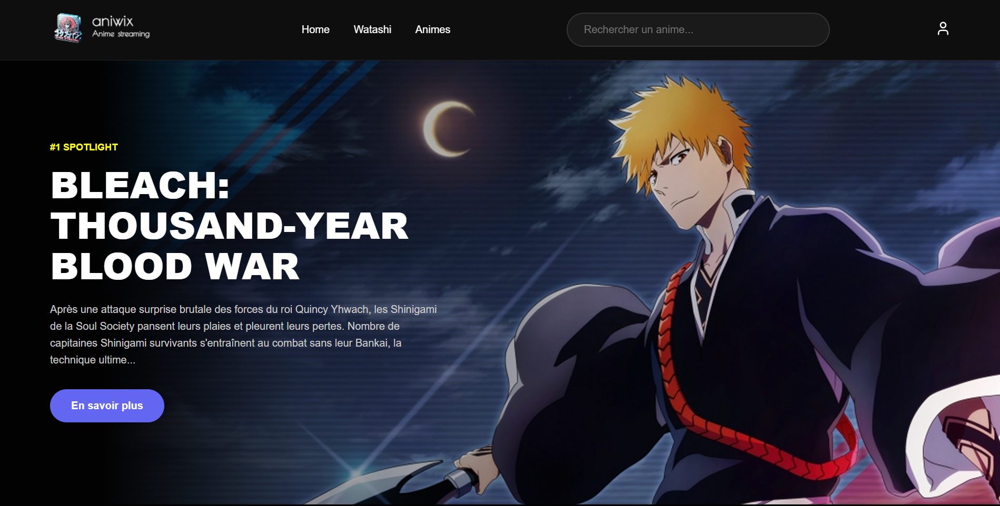

# 🎌 AniWix - Your Personal Anime Encyclopedia

[](https://aniwix.vercel.app)
[](https://github.com/KMV531/aniwix)

[](https://www.php.net/)
[](https://www.mysql.com/)
[](https://jikan.moe/)

> 

**AniWix** is a modern platform for anime enthusiasts to explore a massive database, check deep details, and manage a personal favorite list. Built with passion (and a few breaks to conserve energy).

## Key Features

- **Seamless Exploration**: Search and filter through the Jikan API (MyAnimeList database).
- **Dynamic Wishlist**: Real-time Add/Remove favorite system with MySQL database persistence.
- **Immersive Details**: Synopsis, scores, official trailers, and "More like this" recommendations.
- **Member Area**: Secure authentication system to manage your personal collection.
- **Built-in Wit**: Custom alerts for "work-in-progress" features.

## Tech Stack

| Technology           | Purpose                               |
| -------------------- | ------------------------------------- |
| **PHP 8.x**          | Backend logic & Server-side rendering |
| **MySQL**            | User management & Wishlist storage    |
| **JavaScript (ES6)** | UI Interactions & API Fetching        |
| **Jikan API**        | Anime data source (v4)                |
| **CSS3**             | Styling & Responsiveness              |

## Design Highlights

> "The interface was designed to be as fluid as Studio Pierrot / MAPPA fight scene."

- **Native Dark Mode**: Protecting your eyes during late-night binge-watching sessions.
- **Responsive Cards**: An anime grid that scales perfectly across all devices.
- **User Experience**: Instant feedback when toggling items in your wishlist.

## Why AniWix?

This isn't just a data display; it manages real user states:

- **Security**: Database credentials protected via `.gitignore` and password hashing.
- **Performance**: Asynchronous component loading for a friction-less navigation.
- **Authenticity**: A project made by a fan, for fans.

## Local Development

1. **Clone the repository**:

   ```bash
   git clone https://github.com/KMV531/aniwix.git
   ```

2. Database Configuration:
   - Import the SQL file into your MySQL server.
   - Create an `includes/db.php` file based on the provided logic:

   ```bash
      <?php
          $host = 'localhost';
          $db   = 'aniwix_db';
          $user = 'your_mysql_user_name';
          $pass = 'your_mysql_secret_password';
      ?>
   ```

3. Run the server:
   - Use XAMPP, WAMP, or the internal PHP server:
   ```bash
   php -S localhost:8000
   ```

## Contact & Credits

> Developed by **_Vinny_ (ME)** – Passionate about clean code and Japanese animation.

- Contact: koladjamomo@gmail.com

- Portfolio: [https://kmvdev.vercel.app]
